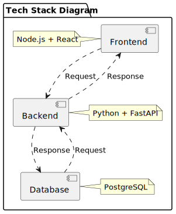

# PBLV 



## HTTP Calls:

### get:cars() ->

**Input:**
```json
[]
```
**Output:**
```json
[{
    id:	
    modell:	
    antrieb:	
    kapatizaet:	
    verbrauch:	
    ladeleistung:
}]
```
### get:fahrten() ->
**Input:**
```json
[]
```

**Output:**
```json
[{
	id:	
	fahrzeug:	
	ankunftTag:	
	ankunftUhrzeit:	
	abfahrtTag:	
	abfahrtUhrzeit:	
	notwendigeLadung:
}]
```

### delete:car(id[int])

**Input:**
```json
{
    id:
}
```
**Output:**
```json
[Bei Erfolg Status Code 200]
```

### get:calculate() ->
**Input:**
```json
[]
```

**Output:**
```json
[{
    tag:
    uhrzeit:
    fahrzeug:
    laden:
}]
```

### post:car() ->
**Input:**
```json
{
    modell:	
    antrieb:	
    kapatizaet:	
    verbrauch:	
    ladeleistung:
}
```
**Output:**
```json
[Bei Erfolg Status Code 200]
```
